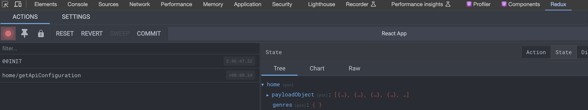
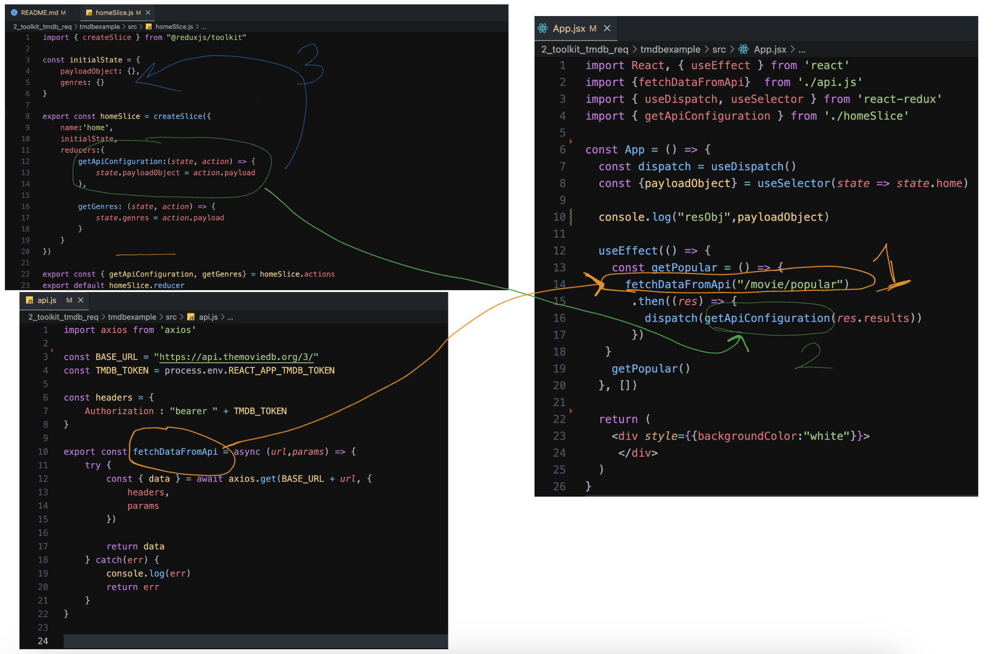

# Redux Toolkit ile API Request & Adımları

## [1] React & Redux Kurulum

### Adım 1: Proje Oluşturma ve Dependencies

```bash
1. cd Desktop
2. mkdir redux-example
3. cd redux-example
4. npx create-react-app ./
5. npm install @reduxjs/toolkit react-redux
6. npm i axios
7. npm start
```

## [2] Vscode tarafında Adım Adım İzlenecek Adımlar
1. store.js oluşturulur.
2. index.js veya main.jsx içinde store & provider ayarı yapılır.
3. slice.js oluşturulur.
4. App.js içindede -> useSelector & dispatch kullanımları yapılır.

## [A] JsonPlaceholder ile Redux Toolkit  createAsyncThunk ile API REQUEST

- Kullanılan end-point:  https://jsonplaceholder.typicode.com/posts

 1. store.js: 

``` javascript
import { configureStore } from "@reduxjs/toolkit";
import postReducer from '../postSlice.js'

export const store = configureStore({
    reducer:{
        ugurPosts:postReducer
    }
})
```

______
2.  index.js
```javascript
import React from 'react';
import ReactDOM from 'react-dom/client';
import './index.scss';
import App from './App';
import { Provider } from 'react-redux';
import { store } from './store/store';


const root = ReactDOM.createRoot(document.getElementById('root'));
root.render(
  <Provider store={store}>
    <App />
  </Provider>
);
```
____

3.  postSlice.js
```javascript
import { createAsyncThunk, createSlice } from "@reduxjs/toolkit"
import axios from "axios"

const initialState = {
    postsArray: []
}

// API REQUEST
export const getAllPosts = createAsyncThunk('myposts/getAllPosts', async () => {
    const response = await axios.get('https://jsonplaceholder.typicode.com/posts');
    return response.data;
});

export const postSlice = createSlice({
    name:"myposts",
    initialState,
    reducers:{},
    extraReducers:(builder) => {
        builder.addCase(getAllPosts.fulfilled, (state, action) =>  {
            state.postsArray = action.payload  // postsArray setlenmesi.
        })
    }
})

export default postSlice.reducer // BURAYI UNUTMAYIN, store.js'taki postReducer kısmı.
````
___

4.  App.js
```javascript
import React, { useEffect } from 'react'
import { useDispatch, useSelector } from 'react-redux'

import { getAllPosts } from './postSlice.js'

const App = () => {
  const dispatch = useDispatch()
  const postArrayDatas = useSelector((state) => state.ugurPosts.postsArray)

  useEffect(() => {
    dispatch(getAllPosts())
  }, [dispatch])

  useEffect(() => {
    if (postArrayDatas && postArrayDatas.length >0) {
        console.log('POSTDATA: ', postArrayDatas)
    }
   
  }, [postArrayDatas])

  return <div>App</div>
}

export default App
```

- console.log'ta responsu görebilirsiniz. . .

## [B]     The Movie DB API Request

##### Redux Devtools Görünümü:


- payloadObject ve genres initialState'lerim.
- reducers kısmındaki action'ların payloadları, initialState'lere setleniyor.

## Tüm yapının tek bir Yerde Gösterimi :



- 1 Numaralı : api.js içindeki, fetchDataFromApi ile, içine parametre olarak verilen end-pointe axios istek yapıyoruz. Gelen datayı, return ile çağrılan yere dönüyoruz. Bu dönülen datayı ise .then() ile yakalıyoruz.

- 2 Numaralı : .then() ile yakaladığımız data'yı res.results ile, homeSlice reducerine yolluyoruz.
Burdaki res.results then ile yakalanıp,  res dediğimiz verinin içindeki results kısmına ulaşıyoruz. 
Bunuda homeSlice reducerine yolladıktan sonra -> o actionın payloadıyla alıp, 3 numaralı kısımda oluşturulan initialState kısımlarına setliyoruz.

- 3 Numaralı: 2. basamakta gelen datayı, initialState dataları setleniyor.

- useSelector kısmı ile ==> 3 numaralı alandaki setlenen veriye ulaşıp, App.jsx içinde <div>'ler arasında kullanmaya yarıyor. Ben burda consola bastım, datanın gelip gelmediği kontrolü için.

